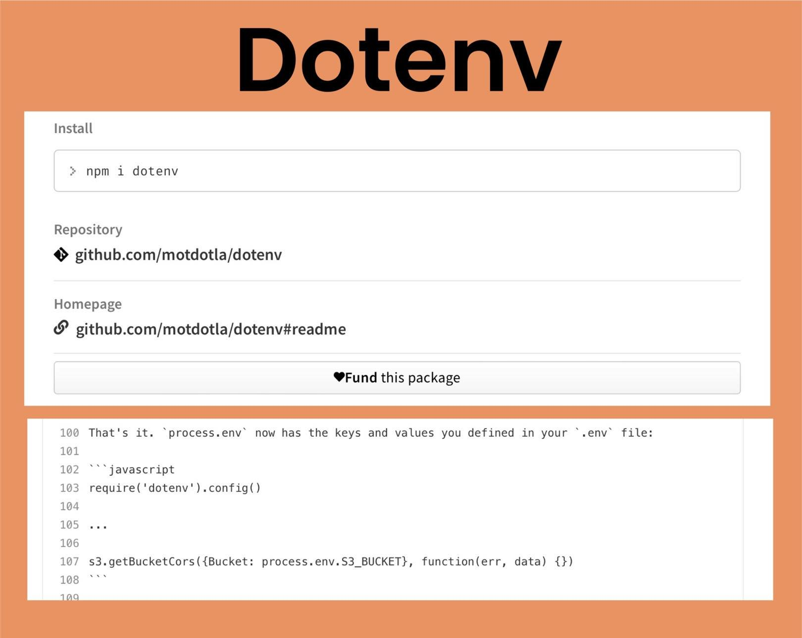
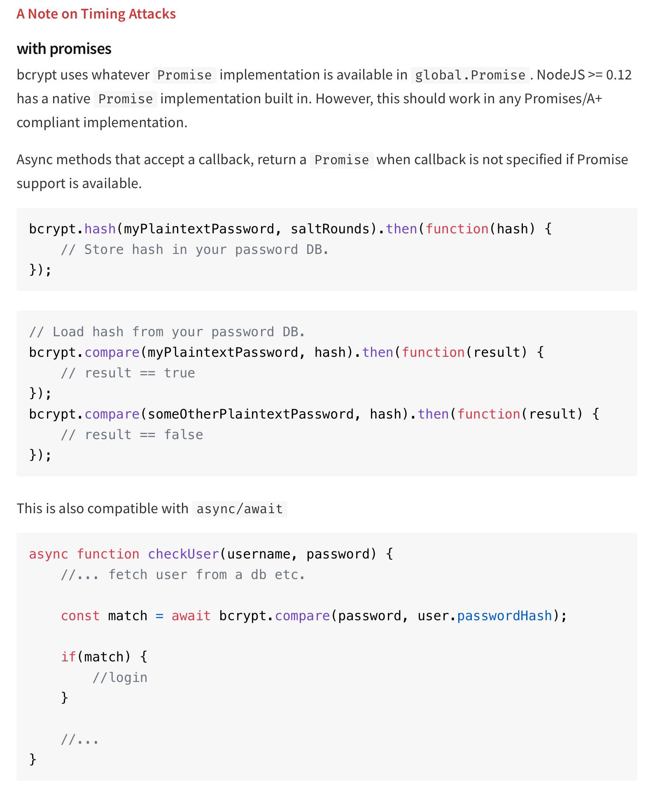

# project-object-relational-mapping-challenge-back-end-e-commerce-module-orm
 back end for an e-commerce site, featuring a working Express.js API and configure it to use Sequelize to interact with a MySQL database.

 

## Description

Built the back end for an e-commerce site, featuring, a working Express.js API and configure it to use Sequelize to interact with a MySQL database. I was provided with starter code (I have provided a screen shot and a link to the strater code.)

GIVEN a functional Express.js API
WHEN I add my database name, MySQL username, and MySQL password to an environment variable file
THEN I am able to connect to a database using Sequelize
WHEN I enter schema and seed commands
THEN a development database is created and is seeded with test data
WHEN I enter the command to invoke the application
THEN my server is started and the Sequelize models are synced to the MySQL database
WHEN I open API GET routes in Insomnia Core for categories, products, or tags
THEN the data for each of these routes is displayed in a formatted JSON
WHEN I test API POST, PUT, and DELETE routes in Insomnia Core
THEN I am able to successfully create, update, and delete data in my database

The first animation shows GET routes to return all categories, all products, and all tags being tested in Insomnia Core:

The second animation shows GET routes to return a single category, a single product, and a single tag being tested in Insomnia Core:

The final animation shows the POST, PUT, and DELETE routes for categories being tested in Insomnia Core:

You’ll need to use the MySQL2Links and Sequelize packages to connect your Express.js API to a MySQL database and the dotenv packageLinks to an external site. to use environment variables to store sensitive data, like your MySQL username, password, and database name.

Use the schema.sql file in the db folder to create your database using MySQL shell commands. Use environment variables to store sensitive data, like your MySQL username, password, and database name.

Database Models
Your database should contain the following four models, including the requirements listed for each model:

Category

id

Integer

Doesn't allow null values

Set as primary key

Uses auto increment

category_name

String

Doesn't allow null values

Product

id

Integer

Doesn't allow null values

Set as primary key

Uses auto increment

product_name

String

Doesn't allow null values

price

Decimal

Doesn't allow null values

Validates that the value is a decimal

stock

Integer

Doesn't allow null values

Set a default value of 10

Validates that the value is numeric

category_id

Integer

References the category model's id

Tag

id

Integer

Doesn't allow null values

Set as primary key

Uses auto increment

tag_name

String

ProductTag

id

Integer

Doesn't allow null values

Set as primary key

Uses auto increment

product_id

Integer

References the product model's id

tag_id

Integer

References the tag model's id

Associations
You'll need to execute association methods on your Sequelize models to create the following relationships between them:

Product belongs to Category, as a category can have multiple products but a product can only belong to one category.

Category has many Product models.

Product belongs to many Tag models. Using the ProductTag through model, allow products to have multiple tags and tags to have many products.

Tag belongs to many Product models.

Make sure you set up foreign key relationships that match the column we created in the respective models.

Fill Out the API Routes to Perform RESTful CRUD Operations
Fill out the unfinished routes in product-routes.js, tag-routes.js, and category-routes.js to perform create, read, update, and delete operations using your Sequelize models.

Be sure to look at your module project's code for syntax help and use your model's column definitions to figure out what req.body will be for POST and PUT routes!

Seed the Database
After creating the models and routes, run npm run seed to seed data to your database so that you can test your routes.

Sync Sequelize to the Database on Server Start
Create the code needed in server.js to sync the Sequelize models to the MySQL database on server start.

## Table of Contents

:bookmark_tabs:

- [Installation](#installation)
- [Links](#links)
- [School Instructions](#school-instructions)
- [Dependencies](#dependencies)
- [Dotenv](#dotenv)
- [ORM](#orm)
- [mysql](#mysql)
- [mysql2](#mysql2)
- [sequelize](#sequelize)
- [MISC](#misc)
- [JawsDB](#jawsdb)
- [bcrypt](#bcrypt)
- [eslint](#eslint)
- [Random Notes](#random-notes)
- [License](#license)
- [How to Contribute](#how-to-contribute)
- [Credits](#credits)
- [Badges](#badges)
- [Tests](#tests)
- [Features](#features)

## Installation

:arrow_down:

:arrow_forward: [Starter Code Link: Click Me To Go To Link](https://github.com/coding-boot-camp/fantastic-umbrella)

:arrow_forward: [Github Link : Click Me To Go To Link](https://github.com/pmastropolo/project-object-relational-mapping-challenge-back-end-e-commerce-module-orm/tree/main)

:arrow_forward: [Youtube Video : Click Me To Go To Link]

## Links

:open_file_folder:

:arrow_forward: Starter Code Link: https://github.com/coding-boot-camp/fantastic-umbrella

:arrow_forward: Github link: https://github.com/pmastropolo/project-object-relational-mapping-challenge-back-end-e-commerce-module-orm/tree/main

:arrow_forward: Youtube Video:

## School Instructions

## Dependencies

- Express.js
npm install express

- Sequelize
npm install sequelize

- MySQL2
npm install mysql2

- dotenv
npm install dotenv

Want to install all at once?
npm install express sequelize mysql2 dotenv

## dotenv

- [dotenv npm](https://www.npmjs.com/package/dotenv)
- [dotenv github](https://github.com/motdotla/dotenv?fbclid=IwAR2_hAbEX8rUPKqbcQi1z7QELvHMldEex6ZLQ3NKHNTYeCw1YH30zl_-BHk)

## ORM

What is it?

Object-relational mapping (ORM), is a technique used in creating a "bridge" between object-oriented programs and, in most cases, relational databases. Put another way, you can see the ORM as the layer that connects object oriented programming (OOP) to relational databases.

- [ORM Wikipedia](https://en.wikipedia.org/wiki/Object%E2%80%93relational_mapping)
- [ORM](https://www.freecodecamp.org/news/what-is-an-orm-the-meaning-of-object-relational-mapping-database-tools/#:~:text=Object%20Relational%20Mapping%20(ORM)%20is,(OOP)%20to%20relational%20databases.)

## Nodemon

What is it?

nodemon is a tool that helps develop Node.js based applications by automatically restarting the node application when file changes in the directory are detected.

nodemon does not require any additional changes to your code or method of development.

To use nodemon, replace the word node on the command line when executing your script.

You can also install nodemon as a development dependency:

npm install --save-dev nodemon

- [nodemon npm](https://www.npmjs.com/package/nodemon)

## mysql

- [mysql website](https://www.mysql.com/)

## mysql2

- [mysql2 npm](https://www.npmjs.com/package/mysql2)

## Sequelize

- [sequelize npm](https://www.npmjs.com/package/sequelize)
- [sequelize](https://sequelize.org/docs/v6/)
- [sequelize models](https://sequelize.org/docs/v6/core-concepts/model-basics/)
- [Data Types](https://sequelize.org/docs/v6/core-concepts/model-basics/#data-types)
- [Associations](https://sequelize.org/docs/v6/core-concepts/assocs/)
- [Model Querying - Basics](https://sequelize.org/docs/v6/core-concepts/model-querying-basics/)
- [Taking advantage of Models being classes](https://sequelize.org/docs/v6/core-concepts/model-basics/#taking-advantage-of-models-being-classes)
- [Validations & Constraints](https://sequelize.org/docs/v6/core-concepts/validations-and-constraints/)
- [belongstomany](https://sequelize.org/api/v6/class/src/associations/belongs-to-many.js~belongstomany)

## MISC

- [VIDEO SUBMISSION HELP](https://coding-boot-camp.github.io/full-stack/computer-literacy/video-submission-guide)
- [ASYNC AND AWAIT](https://developer.mozilla.org/en-US/docs/Web/JavaScript/Reference/Statements/async_function)
- [Try and Catch](https://developer.mozilla.org/en-US/docs/Web/JavaScript/Reference/Statements/try...catch)
- [rest](https://en.wikipedia.org/wiki/REST#Applied_to_web_services)
- [HTTP Status Codes](https://developer.mozilla.org/en-US/docs/Web/HTTP/Status)
- [Full Stack Blog](https://coding-boot-camp.github.io/full-stack/)
- [Deploy with Heroku and MySQL](https://coding-boot-camp.github.io/full-stack/heroku/deploy-with-heroku-and-mysql)

## JawsDB

- [JawsDB MySQL](https://elements.heroku.com/addons/jawsdb)

## bcrypt

- [bcrypt npm](https://www.npmjs.com/package/bcrypt)
- [bcrypt github](https://github.com/kelektiv/node.bcrypt.js?fbclid=IwAR3_mtdkHV3l5mVP8NsXCn4MsbJxGUfZpug8luBF8XntU2FMX_xxRVJv2g8)

## eslint

- [eslint npm](https://www.npmjs.com/package/eslint)
- [eslint website](https://eslint.org/)
- [eslint github](https://github.com/eslint/eslint?fbclid=IwAR189HwHLg5WM6CxjoNCKtXcjGEvLIBw6B7QSyrbduAX1qcAnnG-7-4duQc)

## Homework I Followed

## Random Notes

## License

:heavy_exclamation_mark:

MIT License :license:

## How to Contribute

:tada:

N/A

## Credits

:name_badge:

N/A

## Badges

:trophy:

N/A

## tests

N/A

## features

N/A